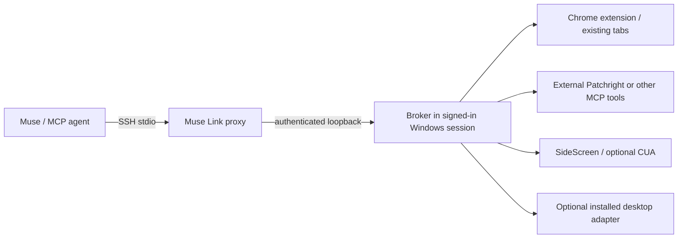

# Muse Link

Connect Muse or another MCP-capable agent to the tools on your signed-in Windows PC over SSH. Keep the browser and desktop processes in the interactive session; expose their tools through a small authenticated loopback broker.

This is the connection layer extracted from a working Muse/OpenClaw setup. It is a separate package from [SideScreen](https://github.com/gitWRLD999/sidescreen), which supplies the optional virtual display and scoped desktop input.



## What is included

For the current tool contract, performance timings and focus limits, read
[the agent channel guide](docs/agent-channel.md). Websites use your pinned
regular Chrome profile; the default agent channel excludes global desktop input.

- CLI and MCP stdio proxy, including an agent-side Python SSH helper.
- A loopback-only broker with per-run credentials, protected local state, and calls serialized per engine, with aliases sharing a queue.
- A Chrome adapter using pinned Playwright MCP in extension mode.
- A combined `agent` MCP channel with nine regular Chrome tools and eight scoped SideScreen tools.
- Configurable external MCP engines and the existing desktop JSON adapter protocol.
- Windows sign-in startup, restart supervision, pause/resume scripts, and transport tests.

No keys, hostnames, personal endpoints, browser profiles, OpenClaw workspace files, or external driver binaries are included. Muse Link does not install an SSH server, configure firewall rules, or create a public tunnel. You need an existing SSH connection; a mutually connected Tailscale network is one option.

## Install on Windows

Use Node.js 22 or later and Git. In the signed-in desktop's PowerShell:

```powershell
$package = Join-Path $env:USERPROFILE 'AgentTools\MuseLinkPackage'
git clone https://github.com/gitWRLD999/muse-link.git $package
Set-Location -LiteralPath $package
npm ci
node .\bin\muse-link.mjs init
node .\bin\muse-link.mjs serve
```

The config defaults to `%USERPROFILE%\AgentTools\MuseLink\config.json`, with credentials in its `state` directory and CLI screenshots in `artifacts`. Ctrl+C stops a manually started broker. A Windows broker providing desktop/browser adapters must run in a signed-in interactive session, rather than an SSH service session.

You can also install the [v1.1.0 npm package archive](https://github.com/gitWRLD999/muse-link/releases/download/v1.1.0/gitwrld999-muse-link-1.1.0.tgz):

```powershell
npm install -g https://github.com/gitWRLD999/muse-link/releases/download/v1.1.0/gitwrld999-muse-link-1.1.0.tgz
muse-link init
muse-link serve
```

The package is distributed on GitHub Releases; it has not been published to the npm registry. Source checkout is convenient when using the startup scripts.

## Use your regular Chrome account

Install the [Playwright MCP Bridge extension](https://chromewebstore.google.com/detail/playwright-mcp-bridge/mmlmfjhmonkocbjadbfplnigmagldckm) in the Chrome profile you want the agent to use. Chrome asks you to select a tab when attaching. The `chrome` engine uses extension mode and does not copy your profile or launch Chrome with a debugging port. See [Playwright MCP's browser extension instructions](https://github.com/microsoft/playwright-mcp#browser-extension).

In `config.json`, pin `regular_chrome.profile` to the profile directory shown in `chrome://version`, such as `Default` or `Profile 1`. The `chrome` alias uses this same connection. This is a local setting. Keep browser consent and credentials on the PC.

```powershell
node .\bin\muse-link.mjs status
node .\bin\muse-link.mjs agent list
```

## Connect Muse or another agent

Configure SSH key authentication for the Windows account and verify the server's host-key fingerprint through a trusted channel before adding it to the agent's `known_hosts`. The SSH helper requires strict host-key checking and refuses password prompts. Use your existing working SSH setup; no SSH passwords or private keys belong in this repo.

Add an SSH alias such as `agent-pc` to the agent's SSH config, pointing to the reachable PC and the correct account/key. Check connectivity first:

```sh
ssh -T -o BatchMode=yes -o StrictHostKeyChecking=yes agent-pc whoami
```

For a command-line agent, Python 3 and OpenSSH are enough on the agent side. Replace the remote script path with the installed Windows path:

```sh
python3 scripts/muse-ssh.py --host agent-pc \
  --remote-script 'C:/Tools/muse-link/bin/muse-link.mjs' status
python3 scripts/muse-ssh.py --host agent-pc \
  --remote-script 'C:/Tools/muse-link/bin/muse-link.mjs' chrome list
```

To use MCP, copy [examples/mcp-ssh.json](examples/mcp-ssh.json) into your MCP client's configuration and replace the alias and remote script path. The recommended `mcp agent` server combines regular Chrome and scoped SideScreen over one persistent SSH connection. This works with a client that can launch an SSH stdio transport; it does not add a new native computer-use capability to a hosted chat interface.

The Python helper also supports MCP streaming:

The helper's remote command assumes Windows OpenSSH's default `cmd.exe` shell. If your SSH server uses a custom shell, use an appropriate direct SSH command in the MCP config instead. Remote paths containing shell expansion/operator characters are refused by the helper.

```sh
python3 scripts/muse-ssh.py --host agent-pc \
  --remote-script 'C:/Tools/muse-link/bin/muse-link.mjs' --mcp sidescreen
```

All MCP protocol output goes to stdout; broker/engine diagnostics go to stderr. CLI screenshots are saved on the PC and returned as paths for retrieval with `scp`. MCP screenshots remain image content.

## Keep it running after sign-in

Once manual access works, stop the manually started broker with Ctrl+C and install the startup task from the package directory:

```powershell
.\scripts\Install-Startup.ps1 -StartNow
```

This registers a task named `Muse Link` for the current user's interactive sign-in. The supervisor restarts the broker if it exits and retries after ten seconds. It waits while another process owns the configured port and never replaces that process. Keep the package directory and Node installation in place. Browser engines reconnect lazily after restart; Chrome may require tab selection again.

This is durable across reboot **after the user signs in**. It does not keep a desktop available through sign-out or provide a VM. Network reachability and browser consent must still be available.

```powershell
.\scripts\Pause-Muse-Link.ps1
.\scripts\Resume-Muse-Link.ps1
```

Pause remains in effect across supervisor restarts. To uninstall startup, pause first, then run:

```powershell
Unregister-ScheduledTask -TaskName 'Muse Link' -Confirm:$false
```

These scripts use the default home or `-HomeDirectory`. `Install-Startup.ps1` records the current Node and package paths, refuses to overwrite an existing task, and does not change the legacy `Muse OpenClaw Tools` task. Supervisors read the specified home's config; temporary shell environment overrides are deliberately cleared.

## External engines and SideScreen

[examples/external-engines.json](examples/external-engines.json) shows external Patchright and desktop adapters. Replace all example paths with your installed tools; these engines are not bundled or enabled by default.

| Engine kind | Interface |
| --- | --- |
| `chrome` | Pinned Playwright MCP extension mode; optional `profile` |
| `mcp` | Trusted local `command`, `args`, optional absolute `cwd` and string `env` |
| `desktop` | One JSON request on stdin, one JSON response on stdout |
| `sidescreen` | Installed `SideScreen.Cua.exe`; optional absolute `directory` |

The preferred SideScreen directory is `%USERPROFILE%\AgentTools\SideScreen`; `SIDESCREEN_HOME` can override it. The old AppData installation remains a fallback. Install SideScreen and its optional CUA integration separately. Discover the display and window handles using status/windows, then observe before each action. SideScreen enforces target containment and observation expiry; Windows focus is still shared, and supported background input is not universal desktop isolation. The unscoped legacy desktop adapter can steal focus.

For the desktop protocol, requests look like `{"action":"/windows","arguments":{}}`; replies look like `{"ok":true,"result":...}`. `/screenshot` may return `result.png_base64`. Only the published action allowlist is exposed. External MCP engine schemas pass through unchanged. Installed OpenClaw tools retain their own dependencies and permissions.

The config is trusted local code-launch configuration, not an agent-facing arbitrary shell tool. Change it only on the PC. Restart the broker to reload it. Runtime RPC accepts only status, tool listing, and tool calls on configured engines.

## Use alongside an already working Muse broker

You do not have to migrate or restart the working connection to try the new CLI/proxy. Point this shell at the **existing** broker's state directory and port:

```powershell
$env:MUSE_LINK_STATE_DIR = 'C:\Path\To\Existing\Muse-OpenClaw\state'
$env:MUSE_LINK_PORT = '18921'
node .\bin\muse-link.mjs status
node .\bin\muse-link.mjs mcp chrome
```

These overrides let the proxy talk to the existing broker, including its installed Patchright and desktop tools. They do not start another broker. For a persistent SSH proxy using the legacy broker, set an absolute `stateDir` and matching `port` in Muse Link's local config for the same Windows account. Do not point a new `serve` instance at a live broker's state directory.

For a later migration, configure the external engines first, pause the old supervisor using its own scripts, then start Muse Link and verify status/tools before enabling its startup task. The two brokers should use separate state directories and different ports if run simultaneously.

## Configuration and boundaries

`MUSE_LINK_HOME` chooses the config/data home. `MUSE_LINK_CONFIG` chooses a config file. `MUSE_LINK_PORT` overrides `port`. `MUSE_LINK_STATE_DIR` overrides `stateDir`. The default port is 18921 and the broker always binds `127.0.0.1`. Non-Windows defaults use `~/.local/state/muse-link` for transport development and external MCP engines; the bundled desktop adapters target Windows.

The broker rejects browser Origin headers, unexpected Host headers, incorrect bearer tokens, malformed JSON, and requests larger than 1 MiB. It rotates credentials only after successfully binding its port. State has restricted Windows ACLs or owner-only directory/file modes on other platforms. Successful calls can still have a tool-specific refusal or error; inspect returned results. Actions are never retried automatically after a timeout or unknown outcome.

SSH provides network transport and account authorization. A user or process already running as that Windows account can access the broker token. Engine calls are serialized across connections; status can be read while a call is busy. Serialization does not reserve the PC for an agent or isolate it from human input. Engine startup may launch processes, so only configure engines you intend to expose.

## Development

```sh
npm ci
npm test
python -m unittest discover -s test -p 'test_*.py'
npm pack
```

CI runs transport/authentication tests on Windows and Linux with Node 22 and 24. Tests use a mock MCP engine and never send desktop input. Optional engines require separate live validation on the machine where they are installed. See [NOTICE.md](NOTICE.md) for source and dependency attribution.
